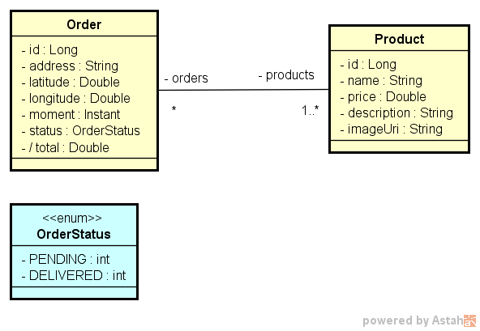
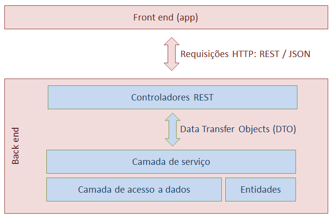

## Projeto realizado na 2ª Semana do DEV Superior, constrindo uma API Rest DSDelivery com SpringBoot.

Para acessar todo o conteúdo da SDS2 <a href= https://github.com/devsuperior/sds2>clique aqui</a>

### Backend

* Java 1.8 ou superiror
* Gradle
* SpringBoot
    * Spring Data JPA
    * Spring Web
    * Postgres
    * H2
    * Lombok
    * Mapstruct
    
### Modelo conceitual

### Padrão de camadas

### Endpoints

Projeto hospedado em https://alexsds2.herokuapp.com/

[GET] https://alexsds2.herokuapp.com/products

[GET] https://alexsds2.herokuapp.com/orders

[POST] https://alexsds2.herokuapp.com/orders

[PUT] https://alexsds2.herokuapp.com/orders/{id}/delivered